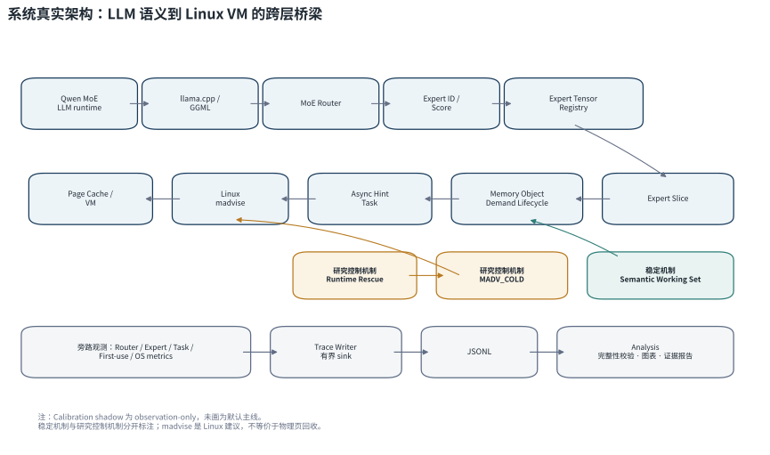
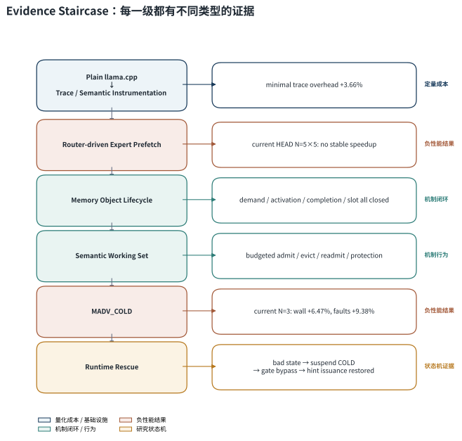
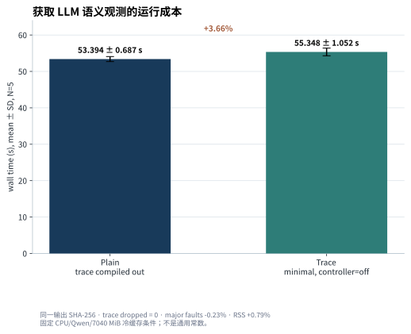
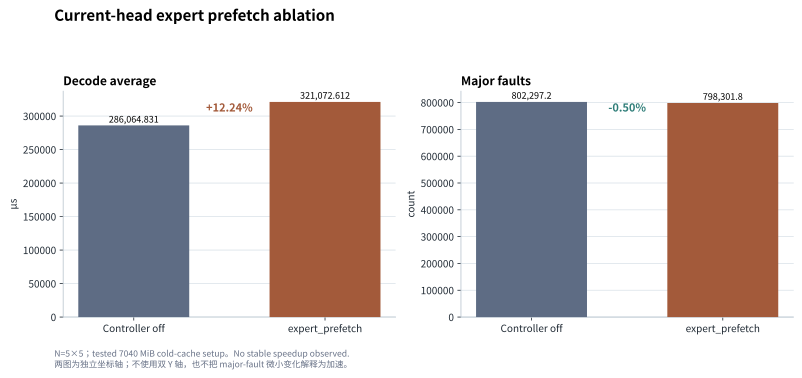
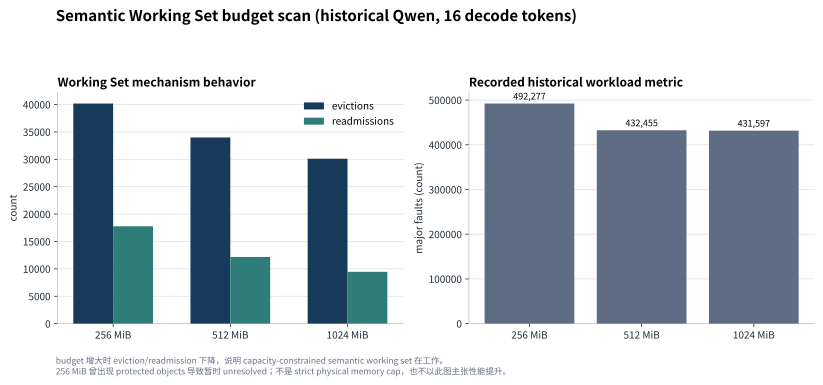
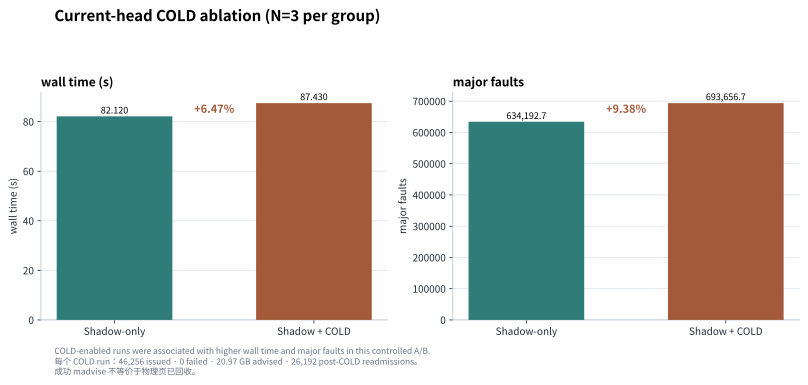
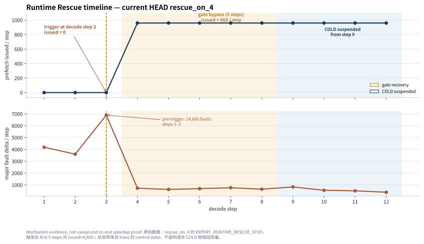

# LLM Runtime / Linux VM 语义工作集管理

面向 CPU 上稀疏 MoE 推理的跨层内存实验系统：在 LLM Runtime 与 Linux VM 之间补充一个**语义内存管理层**，将 `llama.cpp` 已知的 Router、Expert 与 Tensor Slice 语义，映射为可追踪、可管理、可验证的 Memory Object、Semantic Working Set 和 Linux `madvise` 控制信号。

> 全国大学生计算机系统能力大赛操作系统设计赛功能挑战赛道（赛题 `proj59`：内存受限环境的大语言模型推理优化）项目。



本项目的核心贡献不依赖于单个“加速百分比”，而是：

- 建立 LLM Runtime 与 Linux VM 之间的语义观测链：Router → Expert Slice → Task / First-use → OS memory metrics；
- 将 Expert Slice 提升为具有身份、需求和状态的 Memory Object，并提供可审计的生命周期闭环；
- 实现具有 admission、eviction、readmission、protection/probation 的容量约束 Semantic Working Set；
- 以 Prefetch / `MADV_COLD` 的受控负结果约束控制边界，并探索 Runtime Rescue 作为实验性的反馈保护。

完整的实验环境、样本身份、原始指标与证据边界见 [Final README Evidence V2](docs/final-readme-evidence-v2.md)。本文只给出面向评审的系统概览和闭合结论。

## 1. 项目简介

Linux 虚拟内存看到的是 page、`mmap`、page fault 与 RSS；LLM Runtime 知道的却是 token、layer、Router、expert、tensor 和 logical first-use。两者之间缺少可复核的语义连接。本项目不修改 Linux 内核，而是在两者之间补充语义内存管理层：Runtime 的对象状态经由 Memory Object 和 Semantic Working Set 组织后，再以 OS advice 与运行时反馈连接到 Linux VM。

本项目在 `llama.cpp` 的 CPU/MoE 路径中建立这条连接：模型加载阶段登记 Expert Tensor，MoE Router 的实际选择定位到 Expert Slice，异步任务将需求送往 Linux `MADV_WILLNEED` hint 路径，并把 Task、First-use 和 OS 指标写入同一组 trace。当前系统还实现了 Memory Object Lifecycle、Semantic Working Set，以及默认关闭的 `MADV_COLD`、受限 `MADV_DONTNEED` / Runtime Rescue 研究控制机制。

这不是一个已证明通用加速的内存管理器，也不声称实现了 KV Cache 在线替换或可保证的内核页回收。最终系统解决的问题是：**如何把 LLM Runtime 已知的模型语义转化为 OS 可以观测、管理和验证的内存对象、工作集与控制信号。**

## 2. Motivation：为什么 LLM 推理需要 OS 语义

对 Linux VM 而言，专家权重只是文件映射中的地址范围；对 MoE Runtime 而言，下一层将使用哪些 expert 是 Router 已经产生的语义事实。仅靠全局 page fault 或 RSS 很难回答“哪个 expert 的哪个切片、为何、何时被使用”。

本项目将以下两组事实连接起来：

| LLM Runtime 的语义 | Linux / OS 的观测 |
| --- | --- |
| token、layer、Router score、expert | page fault、RSS、文件映射、`madvise` |
| Expert Tensor 与 Slice address/range | `mmap` 区间与 Linux advice |
| Task 发出、logical first-use、生命周期状态 | hint 调用、trace sink、进程级指标 |

这里的 `madvise(MADV_WILLNEED)` 和 `madvise(MADV_COLD)` 都是 Linux advice：它们不是强制 page-in / reclaim，也不能由成功返回推导出物理页已经到位或已经回收。logical first-use 也不是 residency 测量。

## 3. 从 Router-driven Prefetch 到 Semantic Working Set

项目先建立 Router、Expert、Task、First-use 与 OS memory metrics 的跨层 trace，使“hint 已发出”与“真实需求到达”可以被分别观察。Router 随后提供未来 Expert 需求，系统将 `layer + expert + tensor` 映射为实际 Slice 地址范围，形成 opt-in 的 Prefetch 路径；严格 5×5 对照未显示稳定加速后，设计重点转向哪些 Slice 正在被语义需求、应被保护多久、以及何时可退出工作集。因此，Expert Slice 被提升为带状态的 Memory Object，并由容量约束的 Semantic Working Set 管理；`MADV_COLD` 的负结果进一步推动 Runtime Rescue 这类反馈保护，而不是单向 reclaim 策略。

## 4. System Architecture

### 一次 Expert 对象如何经过系统

MoE Router 先给出模型语义上的 Expert ID / score；Registry 将该选择定位为 `mmap` 中的实际 Expert Slice address/range。系统为 Slice 注册 semantic demand，并以 `layer + expert + tensor` 为身份建立或更新 Memory Object；Working Set 随该 demand 进行 admission 或 touch。若启用 Prefetch，Hint Task 经异步 worker 向 Linux 发送 `MADV_WILLNEED`。

真正的矩阵计算第一次触达该 Slice 时，系统记录 logical first-use，并把 demand 从 pending 转为 active；对应 layer 结束时完成 active demand，或取消过期 pending demand。只有不再有 pending / active 语义需求的对象，才可能在预算驱动的 eviction 后进入 probation，并在可选 COLD 路径中成为候选。logical first-use 是 Runtime 的逻辑消费点，不是物理 residency 证明。

```text
Router → Expert Slice → Demand registered → Working Set admit / touch
      → Async WILLNEED → logical first-use → demand completion
      → eviction → probation → optional COLD candidate
```

### 4.1 Runtime Semantic Observation

Trace 记录 MoE Router、Expert、Tensor、Task、logical First-use 与 OS metrics；KV 相关事件可被观测，但本项目不把 KV trace 叙述为已实现 KV 内存管理。各 sink 采用有界异步 writer，并在运行后验证零丢失。

### 4.2 Expert Tensor Registry

模型加载时，`Expert Tensor Registry` 登记可识别的 MoE expert tensor。运行时将 Expert ID / score 定位为 `layer → tensor → expert slice address/range`，这是 Runtime 语义进入内存地址空间的映射边界。

### 4.3 Async Expert Hint Path

语义需求形成异步任务，经 queue 与 worker 进入 `MADV_WILLNEED` 路径。当前标准 pipeline 的 controller 仅支持：

- `off`：关闭 controller；
- `expert_prefetch`：启用 opt-in 的 Router-driven Expert Prefetch 配置。

该路径证明 Router → Expert Slice → Task → OS hint 可以真实运行；它不等价于“hint 已完成 page-in”。

### 4.4 Memory Object Lifecycle

Memory Object 不是地址范围的包装。它以 `layer / expert / tensor` 作为 object key，并保存当前 `address + nbytes` Slice 范围；同时维护 demand 的 `pending` / `active` 状态、in-flight hint slot、Working Set membership 与 `last_touch`，以及 shadow eviction / probation 状态。生命周期为：

`Demand registration → Activation → Completion → hint-slot release`

它让“谁仍需要该 Slice、需求是否已开始或结束、是否存在 in-flight hint、能否进入 eviction / COLD 候选”由同一实体管理；同时覆盖单飞聚合（single-flight）和 stale cancellation。其价值是可审计的状态语义与不变量，而不是已证明的性能提升。

### 4.5 Semantic Working Set

Working Set 是一个**容量约束的语义工作集**，并非 Linux RSS 的硬 cap。

- **Admission / touch**：注册新的 semantic demand 时，对象进入或 touch Working Set；已被 shadow eviction 的对象再次产生 demand 时，重新 admission，并记为 readmission。
- **Protection**：`pending_users > 0` 或 `active_users > 0` 的对象不参与 eviction；这表示它仍有未完成的语义需求。
- **Eviction**：budget 超额后，扫描当前 Working Set，选择 `last_touch_seq` 最小的、没有 pending / active demand 的对象，即按最后语义 touch 的 LRU 顺序淘汰；被淘汰对象进入 probation。
- **Readmission / COLD 候选**：probation 中的对象若再次 demand 会取消该轮 probation 并回到工作集。只有已被 eviction、无活跃需求且经过 grace steps 的对象，才可进入可选 COLD 候选流程。

protected object 可以使预算短时间无法满足；这恰恰说明 budget 是语义容量约束，而不是物理内存上限。

### 4.6 OS Memory Actions

`MADV_WILLNEED` 用于 expert hint；`MADV_COLD` 是受研究开关保护的冷对象 advice；`MADV_DONTNEED` 只处理已经 shadow eviction、无 pending/active/in-flight hint、经过 grace steps 的 Expert Slice。DONTNEED 还要求 Slice 的完整范围位于 `/proc/self/maps` 识别的文件映射中，并只建议 Slice 内部的完整页。三者都只是 Linux 建议，不提供物理页回收或 page-in 完成的保证。

### 4.7 Runtime Rescue

Runtime Rescue 是实验性 guard。当前 `gate_recovery` 原型只在 Decode 的前 3 个 step 评估：三步累计 Prefetch `issued < 300` **且**累计 `major_fault_delta > 6000` 时触发，表示早期 hint issuance collapse 与高 page-fault 状态同时出现。该阈值是当前实验的 early-warning rule，不是跨模型普适的坏状态定义。

本轮固定配置的 re-entry rate=0：触发后立即 suspend COLD，并对 value gate 进行 5 个 Decode step 的 temporary bypass，以恢复后续 hint issuance；随后保持 COLD suspended。它只具有条件性状态机证据，尚不构成整体性能因果证明。

## 5. Evidence Staircase



项目不是由一个最终分数支撑，而是逐层建立不同性质的证据：

1. Plain `llama.cpp` 与最小 Trace 的定量观测成本；
2. Router-driven Expert Prefetch 的当前 HEAD 负性能结果；
3. Memory Object demand / activation / completion / slot 的闭环；
4. Semantic Working Set 的 budgeted 行为；
5. `MADV_COLD` 的当前 HEAD 受控负结果；
6. Runtime Rescue 的状态机路径与正常态静默证据。

这一区分很重要：机制闭环、行为观察、负性能结果与状态机动作不是同一种证据，也不应被拼接成未经证明的“整体加速”。

## 6. Evaluation

所有数字均来自固定的 Qwen CPU 冷缓存环境：WSL2 / Linux 6.6.114.1、Intel i9-13980HX、`Qwen3.5-35B-A3B-Q3_K_M.gguf`、80 tokens、8 CPU threads、每个 transient service `MemoryMax=7040M`。结果是该环境下的闭合证据，不是跨硬件或跨模型常数。

### 6.1 Trace 基础设施开销



同一源码 HEAD 下，Plain 由 `LLAMA_MEM_TRACE=OFF` 构建；Trace 由 `LLAMA_MEM_TRACE=ON` 构建且 controller 为 `off`。两侧均为 N=5。

| 指标 | Plain | Trace 最小观测、controller=off | 相对变化 |
| --- | ---: | ---: | ---: |
| wall time | 53.394 ± 0.687 s | 55.348 ± 1.052 s | **+3.66%** |
| major faults | 785,218.2 | 783,389.0 | -0.23% |
| max RSS | 6,746,882 KiB | 6,799,906 KiB | +0.79% |

输出 SHA-256 一致；5 个 Trace 样本均为 `dropped=0`。因此可安全表述为：在该 CPU/Qwen 冷缓存基准中，最小语义观测基础设施的 wall-time 成本约为 3.66%。它不是预取收益，也不是通用常数；这一定量成本为后续机制比较提供了可核查的观测基线。

### 6.2 Router-driven Expert Prefetch



当前 HEAD、N=5+5、7040 MiB 冷缓存配置的对照结果如下：

| 指标 | Controller off | `expert_prefetch` | 相对变化 |
| --- | ---: | ---: | ---: |
| decode average | 286,064.831 µs | 321,072.612 µs | **+12.24%** |
| major faults | 802,297.2 | 798,301.8 | -0.50% |

当前环境**没有观察到稳定加速**。该结果并不否认路径可执行：Router → Expert Slice → Task → OS hint 已被真实运行和追踪；它说明“可预测”不等于“执行更多 Prefetch 就会获得系统收益”。因此项目转向回答：哪些 Expert 当前确有需求、需要被保护多久，以及何时可以安全退出工作集。早期归档中的大幅 fault / decode 数字不属于当前主线，未作为当前收益引用。

### 6.3 Memory Object Lifecycle

在 current HEAD、N=5 的 Lifecycle OFF/ON 对照中，Lifecycle ON 的 wall time 为 63.094 ± 7.884 s，相对 55.488 ± 0.644 s 的 OFF 为 **+13.71%**。这不是性能提升证据。

它验证的是状态闭环：每个 ON run 都记录 102,222 个 demand、102,222 个 activation、102,222 个 completion，且 slot acquire / release 均为 102,222；终态 `pending=0`、`active=0`、`invariant_violations=0`。因此可审计 lifecycle bookkeeping 的正确性，同时承认其在该 workload 上有可测成本和高方差。Lifecycle 首先解决状态语义与正确性，为后续 Working Set 的 protection / eviction 提供依据，而不是直接承担性能提升职责。

### 6.4 Semantic Working Set（历史 budget scan）



上图是**历史 Qwen、16 decode tokens** 的 256 / 512 / 1024 MiB budget scan，用于展示机制行为，而不是 current-HEAD 性能结论。budget 增大时 eviction 和 readmission 总体下降，表明 admission、eviction、readmission 与 protection 被真实执行。

256 MiB 档曾因 protected objects 暂时出现 unresolved work；这说明该机制是 semantic capacity constraint，而不是严格物理 memory cap。当前 HEAD 的 1024 MiB 运行也记录了相同语义计数与闭合终态。Working Set 将对象状态转化为 admission / eviction 决策，但 semantic eviction 本身仍不等于应立即触发 Linux reclaim，详见 [V2 证据报告](docs/final-readme-evidence-v2.md#5-semantic-working-set)。

### 6.5 `MADV_COLD`：重要的负结果



current HEAD 的 Shadow-only 与 Shadow + COLD 对照为 N=3/组；唯一实验差异是 COLD advice 开关。

| 指标 | Shadow-only | Shadow + COLD | 相对变化 |
| --- | ---: | ---: | ---: |
| wall time | 82.120 ± 5.887 s | 87.430 ± 5.226 s | **+6.47%** |
| major faults | 634,192.7 | 693,656.7 | **+9.38%** |

每个 COLD run 记录 46,256 次 issued、0 failed、20.97 GB advised 和 26,192 次 post-COLD readmissions。Linux 接受 COLD syscall 不等于物理页已回收，更不等于系统级策略正确；在这个受控 A/B 中，COLD-enabled runs 与更高 wall time 和 major faults 相关。这个负结果说明 semantic cold 与 immediate reclaim 不能简单画等号，因此后续控制开始引入运行状态反馈；COLD 保持 research controller / 默认关闭定位。

### 6.6 Runtime Rescue



图中展示的是 `rescue_on_4` 的当前 HEAD trace：decode step 1–3 的 issued 为 0，step 3 触发定义的坏状态；随后执行 gate bypass，前 5 个 post-trigger steps 共恢复 4,800 个 hint issuance，并从 step 9 起记录为 `cold_suspended`。

在同配置 Rescue ON 的 N=5 中，有 2 次进入定义的坏状态并执行恢复，另 3 次正常态保持静默。可以得出的结论是：实验性 Rescue guard 能在观测到定义的坏状态后暂停 COLD 并恢复 hint 发出。Rescue 是对 COLD / gate 冲突的反馈保护，而不是已经证明整体加速的最终控制器；因此这里不将 OFF/ON 的聚合 wall 或 fault 差异作为“性能提升”标题。

## 7. Correctness / Reliability

闭合实验集的可信度由以下检查支撑：

| 检查 | 结果 |
| --- | --- |
| 新鲜真实 Qwen runs | 38 / 38 exit code = 0 |
| 输出一致性 | 38 / 38 output SHA-256 identical |
| Trace 完整性 | 33 / 33 Trace runs 的 enabled sink 均为 zero dropped events |
| Memory Object 终态 | `pending=0`、`active=0`、`invariant violations=0` |
| 相关 CTest | 5 / 5 passed |

这些检查说明实验路径保持输出一致、trace 完整和状态收尾；它们不替代端到端性能或跨环境泛化证据。

## 8. Design Exploration / Negative Results

下表保留最能解释当前设计收缩的历史探索；它们不属于 current HEAD 的可选 controller。

| 探索 | 为什么做 | 核心观察 | 决定 |
| --- | --- | --- | --- |
| Expert Cache | 将权重管理抽象为传统 cache replacement | LRU/LFU proxy 与 Router 语义信号不匹配 | 不将通用 cache replacement 作为主线 |
| Complex scheduling policies | 对阶段优先级、slack、公平保护与老化等进行探索 | 局部指标改善未稳定转化为端到端收益，并可能引入锁、扫描与 late regression | 归档复杂调度路径 |
| `MADV_COLD` | 将语义上已退出工作集的对象交给 Linux advice | 当前受控 A/B 未显示净收益 | 保留为默认关闭的 research control，见第 6.5 节 |

其他 shadow pressure、cross-layer prediction 等路线及完整负结果见 [技术考古报告](docs/technical-archaeology-report.md) 与 `experiments/expert_prefetch/` 归档。

## 9. Current Status

### Current system

| Mechanism | Status |
| --- | --- |
| Trace Infrastructure | 当前稳定基础设施；运行后校验 sink 完整性与输出一致性 |
| Router-driven Expert Prefetch | opt-in mainline profile；未观察到稳定性能加速 |
| Memory Object Lifecycle | 已实现并验证 demand / slot / 终态语义 |
| Semantic Working Set | 已实现并验证 admission / eviction / readmission / protection 语义 |

### Research controls

| Mechanism | Status |
| --- | --- |
| `MADV_COLD` | research controller，默认 OFF；未证明稳定净收益 |
| `MADV_DONTNEED` | memory-pressure reclaim controller，默认 OFF；待场景 A 验证 |
| Runtime Rescue | experimental guard；具备条件性状态机证据 |
| Calibration Shadow / Controller | observation / research mechanism，非默认主线 |

### Archived explorations

历史 scheduling、prediction 与 cache paths 已归档，不代表 current HEAD 能力。

## 10. Build & Reproduction

以下命令与当前代码的 `llama.cpp/trace/run_trace_pipeline.sh` 一致。pipeline 需要 Linux、GNU `time` 和分析依赖；默认拒绝脏 Git worktree、非零退出和 enabled sink 的 dropped events。

### 10.1 普通构建（不开启 Trace）

```bash
cmake -S llama.cpp -B llama.cpp/build-plain \
  -DLLAMA_MEM_TRACE=OFF \
  -DLLAMA_BUILD_TESTS=OFF \
  -DCMAKE_BUILD_TYPE=Release
cmake --build llama.cpp/build-plain --target llama-cli -j"$(nproc)"
```

### 10.2 Trace 构建

```bash
cmake -S llama.cpp -B llama.cpp/build \
  -DLLAMA_MEM_TRACE=ON \
  -DLLAMA_BUILD_TESTS=ON \
  -DCMAKE_BUILD_TYPE=Release
cmake --build llama.cpp/build -j"$(nproc)"

python3 -m pip install -r llama.cpp/trace/requirements-analysis.txt
```

`run_trace_pipeline.sh` 默认使用 `llama.cpp/build/bin/llama-cli`。模型默认路径为 `models/Qwen3.5-35B-A3B-Q3_K_M.gguf`；实际复现时建议明确设置 `MODEL_FILE`。

### 10.3 Baseline run：Trace + controller off

```bash
MODEL_FILE=/path/to/Qwen3.5-35B-A3B-Q3_K_M.gguf \
RUN_NAME=baseline \
TRACE_PROFILE=benchmark \
CACHE_MODE=cold \
LLM_MEM_TRACE_OPT_EXPERT_CONTROLLER=off \
bash llama.cpp/trace/run_trace_pipeline.sh
```

### 10.4 Expert Prefetch run：opt-in

```bash
MODEL_FILE=/path/to/Qwen3.5-35B-A3B-Q3_K_M.gguf \
RUN_NAME=expert_prefetch \
TRACE_PROFILE=benchmark \
CACHE_MODE=cold \
LLM_MEM_TRACE_OPT_EXPERT_CONTROLLER=expert_prefetch \
bash llama.cpp/trace/run_trace_pipeline.sh
```

`LLM_MEM_TRACE_OPT_EXPERT_CONTROLLER` 当前只接受 `off` 或 `expert_prefetch`。单次运行会写入 manifest、cache preparation、进程指标、输出 hash、JSONL / summary 和 analysis；结果目录为：

```text
llama.cpp/trace_output/<RUN_NAME>/
├── run_manifest.json
├── cache_preparation.json
├── process_metrics.json
├── output.sha256
├── summary.json
└── analysis/
```

### 10.5 启动期内存配置模板

`LLM_MEM_TRACE_OPT_EXPERT_PROFILE` 只在创建 `llama_context` 前选择 KV 类型、上下文容量和 ubatch；运行中不会改变这些参数。显式设置 `CTX_SIZE`、`UBATCH_SIZE`、`BATCH_SIZE`、`KV_CACHE_TYPE_K`、`KV_CACHE_TYPE_V` 或 `FLASH_ATTN` 时，显式值优先。每次运行会将最终配置写入 `run_manifest.json`。

| Profile | K/V KV 类型 | ctx | ubatch |
| --- | --- | ---: | ---: |
| `survival` | `q8_0` / `f16` | 1024 | 64 |
| `balanced` | `q8_0` / `f16` | 1536 | 128 |
| `performance` | `f16` / `f16` | 2048 | 512 |
| `custom`（默认） | `f16` / `f16` | 2048 | 512 |

`survival` 的默认 ctx 取 1024，而不是 512，避免固定测试 Prompt 加生成预算超过上下文。若实际请求所需上下文更大，应显式设置 `CTX_SIZE`；若量化 V，必须同时设定兼容的 `FLASH_ATTN=on`。

Router 解析、Memory Object 状态更新与 JSONL 写出已分离：关闭 `LLM_MEM_TRACE_EXPERT=0` 只关闭原始 `EXPERT_ROUTE` 事件，不会在已启用的 Expert Prefetch 或 Memory Object 管理中丢失 Router 语义。关闭 MEMORY sink 也不会停止这两类状态更新；它只不再写入对应事件和汇总。

```bash
MODEL_FILE=/path/to/Qwen3.5-35B-A3B-Q3_K_M.gguf \
RUN_NAME=survival_static \
LLM_MEM_TRACE_OPT_EXPERT_PROFILE=survival \
TRACE_PROFILE=benchmark \
bash llama.cpp/trace/run_trace_pipeline.sh
```

### 10.6 控制期 Trace profile

`TRACE_PROFILE=control` 用于测量管理策略本身，严格关闭 Tensor、KV、Expert、驻留、smaps、详细 Task 以及逐 step 的 Memory JSONL。Router 解析、cgroup/压力读取、Working Set 状态和控制器状态仍执行；`memory_trace.jsonl` 只接受进程结束时的 `*_SUMMARY` 与 `CONTROL_TRACE_SUMMARY`。`summary.json` 会记录 `"control_only": true`。

```bash
MODEL_FILE=/path/to/Qwen3.5-35B-A3B-Q3_K_M.gguf \
RUN_NAME=balanced_control \
LLM_MEM_TRACE_OPT_EXPERT_PROFILE=balanced \
TRACE_PROFILE=control \
LLM_MEM_TRACE_OPT_EXPERT_CONTROLLER=expert_prefetch \
bash llama.cpp/trace/run_trace_pipeline.sh
```

该 profile 没有 `STEP_END`，因此不报告 decode p95；用 `process_metrics.json` 的 whole-process wall time、major faults、max RSS 做重复实验聚合。`summarize_repeat_runs.py` 已支持该指标口径。需要逐 token 或 p95 延迟时使用 `TRACE_PROFILE=benchmark`，不能将两种 trace profile 混在同一对照组。

### 10.7 受限 DONTNEED 回收

`LLM_MEM_TRACE_OPT_EXPERT_MADV_DONTNEED_RECLAIM=1` 只在 Decode 的 layer end 尝试回收。它要求 Working Set 已经 shadow eviction、`pending_users == 0`、`active_users == 0`、没有 in-flight hint，并等待 `LLM_MEM_TRACE_OPT_EXPERT_RECLAIM_GRACE_STEPS`（默认 3）个 step。每个候选还要经 `find_file_mapping` 检查，并只对 Slice 内部完整页调用 `MADV_DONTNEED`。

触发门控为 `memory.current / effective cgroup limit >= 85%`（优先 `memory.high`，否则 `memory.max`）或 `workingset refault_delta >= 1024`；二者均可通过环境变量调整。全 Decode step 的总建议上限由 `LLM_MEM_TRACE_OPT_EXPERT_RECLAIM_MAX_MB_PER_STEP` 控制，默认 64 MiB。DONTNEED 与 COLD 同时启用时，DONTNEED 优先，避免同一 eviction episode 收到两种 reclaim advice。

```bash
MODEL_FILE=/path/to/Qwen3.5-35B-A3B-Q3_K_M.gguf \
RUN_NAME=survival_dontneed \
LLM_MEM_TRACE_OPT_EXPERT_PROFILE=survival \
TRACE_PROFILE=control \
LLM_MEM_TRACE_OPT_EXPERT_WORKING_SET_MB=256 \
LLM_MEM_TRACE_OPT_EXPERT_MADV_DONTNEED_RECLAIM=1 \
LLM_MEM_TRACE_OPT_EXPERT_RECLAIM_MAX_MB_PER_STEP=64 \
bash llama.cpp/trace/run_trace_pipeline.sh
```

`EXPERT_MEMORY_OBJECT_SUMMARY` 会报告候选、issued/failed bytes、预算延后、in-flight 跳过、映射/页对齐拒绝和 DONTNEED 后 readmission。该机制默认关闭；`madvise` 成功不表示物理页一定已经释放。

### 10.8 场景 B：有预算保护的启动预加载

`performance` profile 在模型完成映射后，遍历已登记的 Expert Tensor。每个范围必须完整位于文件映射内，并裁剪为映射内部的完整页；随后优先调用 `MADV_POPULATE_READ`，内核返回 `EINVAL`、`ENOSYS` 或 `EOPNOTSUPP` 时回退到 `MADV_WILLNEED`。

预加载只在以下严格条件成立时执行：

```text
memory.current + model_size + KV_reserve + buffer_reserve < 0.8 × effective_cgroup_limit
```

`effective_cgroup_limit` 优先取有限的 `memory.high`，否则取有限的 `memory.max`。没有有限 cgroup 上限、模型大小无效或预算不足时，机制拒绝预加载并在 `EXPERT_PRELOAD_SUMMARY` 写出原因；不会为了预加载触发 OOM。`madvise` 成功仅表示内核接受建议，不能据此声称页面会一直驻留。

场景 B 使用两个独立的 `systemd-run --user --scope` 持久 `llama-server` 进程：基线关闭预加载，performance 组开启预加载。每组都在启动前执行 `posix_fadvise(DONTNEED)`，每个进程顺序处理至少两个请求。报告包含：

- 冷启动总时间（从启动 scope 到 `/health` 就绪，包含模型加载和预加载）；
- 第一个请求 TTFT；
- 后续请求的流式生成事件间隔 p95、服务端平均 decode/token 时间 p95；
- 从 scope 启动前到请求结束的 `pgmajfault` 增量；
- 输出 hash 一致性和 `EXPERT_PRELOAD_SUMMARY` 的实际 advice 数量。

在物理可用内存小于 `model_size + KV_reserve + buffer_reserve` 时，脚本会生成 `SKIPPED.md` 后退出，不会依靠 overcommit 伪造预加载结果。请在至少能容纳完整模型和预留空间的机器运行：

```bash
MODEL_FILE=/path/to/Qwen3.5-35B-A3B-Q3_K_M.gguf \
MEMORY_MAX=20G \
RUN_PREFIX=final_b \
bash llama.cpp/trace/run_scenario_b.sh
```

结果位于 `llama.cpp/trace_output/scenario_b/final_b_{baseline,performance,report}/`。只有两个输出 hash 一致且 performance 组的 `preload_decision=issued` 时，才能比较性能指标；报告不自动宣称性能收益。

### 10.9 相关 CTest

```bash
ctest --test-dir llama.cpp/build --output-on-failure \
  -R '^(test-router-tensor-observation-sync|test-router-control-decoupling|test-trace-control-profile|test-expert-hint-priority|test-expert-task-lifecycle|test-expert-memory-object|test-expert-calibration-shadow)$'
```

这些测试检查局部同步、priority、task lifecycle、Memory Object 与 calibration shadow 语义；单测通过不构成性能收益。

## 11. Repository Layout

| 路径 | 内容 |
| --- | --- |
| `llama.cpp/` | 上游 `llama.cpp` 源码及本项目的 CPU/MoE trace 集成 |
| `llama.cpp/trace/` | Registry、task lifecycle、Memory Object、writer、分析与 pipeline 脚本 |
| `experiments/expert_prefetch/` | 历史 Expert Prefetch 探索与归档材料（不代表 current HEAD） |
| `docs/` | 设计、证据、考古与交付文档 |
| `docs/assets/` | README / 答辩使用的 SVG 与 PNG 图表 |
| `docs/data/` | 图表指标、实验身份与 claim boundary 数据索引 |

## 12. Limitations

- 当前闭合测试主要针对 `Qwen3.5-35B-A3B`、CPU-only、当前 WSL/Linux 与冷缓存环境；不应外推为跨硬件或跨模型结论。
- 当前控制机制尚未证明稳定端到端性能提升：Prefetch 未稳定加速，`MADV_COLD` 在当前 N=3 对照中与更高 wall time 和 major faults 相关。
- Runtime Rescue 只有条件性机制证据；尚无严格状态匹配的整体性能因果证明。
- `madvise` 是 Linux hint；不应由此推断 page-in 完成、物理页回收或精确驻留状态，包括受限 DONTNEED 成功返回。
- Working Set 是 semantic capacity constraint，不是严格物理 memory cap。
- Memory Object Lifecycle 在该 workload 上有可测运行开销与高方差；其核心证据是状态正确性。
- 未可靠采集 swap peak，因此不报告 swap peak 性能结论。
- KV 仅被观测，不包含在线 KV 内存管理策略。

## 13. Evidence and Documentation

- [Final README Evidence V2](docs/final-readme-evidence-v2.md)：最终环境、样本与闭合实验事实。
- [README 图表数据与表述边界](docs/data/readme-figures-data.md)：每张图的 current HEAD / historical 身份及允许的 claim。
- [README 可视化交付说明](docs/readme-visualization-report.md)：图表用途和必须保留的 caveat。
- [技术考古报告](docs/technical-archaeology-report.md)：项目演化与历史路线，仅作背景理解；与 V2 冲突时以 V2 为准。

## License

本队新增代码和文档采用 Apache-2.0；第三方 `llama.cpp` 代码保留其原始 MIT License。
