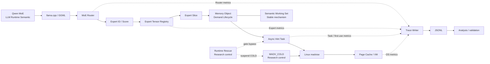

# System Architecture Mermaid Backup

`MADV_COLD` is an advisory Linux call, not a claim of physical page reclamation. Calibration shadow is observation-only and intentionally omitted from the default main path.
